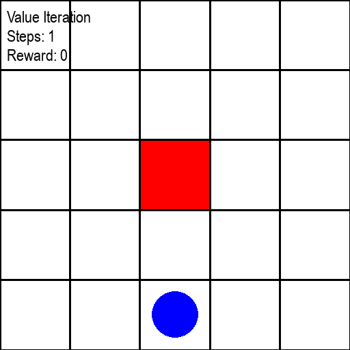

# GridworldRL
Single-agent and Multi-agent Reinforcement Learning in a simple Grid-world environment. 

Compared **Value Iteration** (known transitions and rewards: model-based) with **Q-learning** (unknown transitions and rewards: model-free).

| **Feature**                         | **Value Iteration**                                                                                                                                     | **Q-learning**                                                                                          |
|-------------------------------------|---------------------------------------------------------------------------------------------------------------------------------------------------------|----------------------------------------------------------------------------------------------------------|
| Needs full knowledge of the environment? | ✅ Yes                                                                                                                                              | ❌ No                                                                                                     |
| Exploration required?               | ❌ No                                                                                                                                               | ✅ Yes (e.g., ε-greedy)                                                                                  |
| Algorithm                           | Bellman equation updates over all states                                         | Trial-and-error with q-table updates over all states|
| Convergence                         | Fast & deterministic                                                                                                                   | Slower, stochastic                                                                                       |
| When to use                         | Known small MDPs                                                                                                                                       | Large or unknown environments                                                                            |

---

## 🎥 Single-Agent Behavior

<table>
<tr>
<td align="center"><strong>Value Iteration</strong> </td>
<td align="center"><strong>Q-learning</strong> </td>
</tr>
</table>

## 🎥 Multi-Agent Behavior

<table>
<tr>
<td align="center"><strong>Value Iteration</strong> </td>
<td align="center"><strong>Q-learning</strong> </td>
</tr>
</table>

## 🧪 Training Results

| Metric                        | Value Iteration | Q-learning |
|-------------------------------|-----------------|------------|
| Episodes to convergence       | *1*             | *~120*     |
| Average reward                | *1.0*           | *0.9*      |
| Average steps to goal         | *~6*            | *~6.8*     |

Cummulative reward : average cumulative reward per episode over time
Convergence time or episodes to convergence
steps per episode