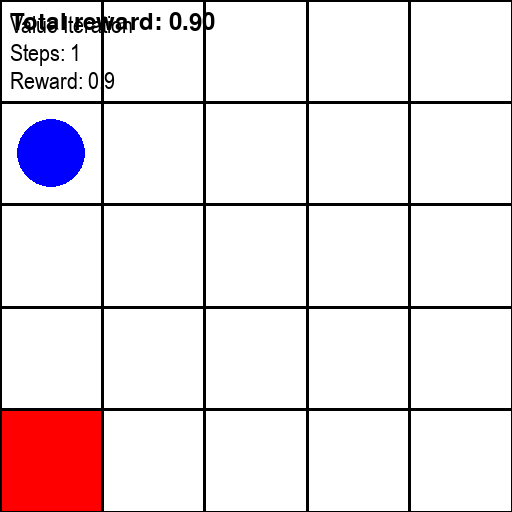

# GridworldRL
Reinforcement Learning in a simple Grid-world environment. 

Compared **Value Iteration** (known transitions and rewards) with **Q-learning** (unknown transitions and rewards).

## 🎥 Agent Behavior

<table>
<tr>
<td align="center"><strong>Value Iteration</strong> </td>

</tr>
</table>

<td align="center"><strong>Q-learning</strong> </td>

| **Feature**                         | **Value Iteration**                                                                                                                                     | **Q-learning**                                                                                          |
|-------------------------------------|---------------------------------------------------------------------------------------------------------------------------------------------------------|----------------------------------------------------------------------------------------------------------|
| Needs full knowledge of the environment? | ✅ Yes                                                                                                                                              | ❌ No                                                                                                     |
| Algorithm                           | Bellman updates over all states: **V(s) = maxa [ R(s,a) + γ Σ P(s'|s,a) * V(s') ]**                                                    | Trial-and-error with updates: **Q(s,a) ← Q(s,a) + α [ r + γ * maxa' Q(s',a') - Q(s,a) ]** |
| Exploration required?               | ❌ No                                                                                                                                               | ✅ Yes (e.g., ε-greedy)                                                                                  |
| Convergence                         | Fast & deterministic (if model known)                                                                                                                  | Slower, stochastic                                                                                       |
| When to use                         | Known small MDPs                                                                                                                                       | Large or unknown environments                                                                            |

---

## 🧪 Training Results

| Metric                        | Value Iteration | Q-learning |
|-------------------------------|-----------------|------------|
| Episodes to convergence       | *1*             | *~120*     |
| Average reward                | *1.0*           | *0.9*      |
| Average steps to goal         | *~6*            | *~6.8*     |

Cummulative reward : average cumulative reward per episode over time
Convergence time or episodes to convergence
steps per episode